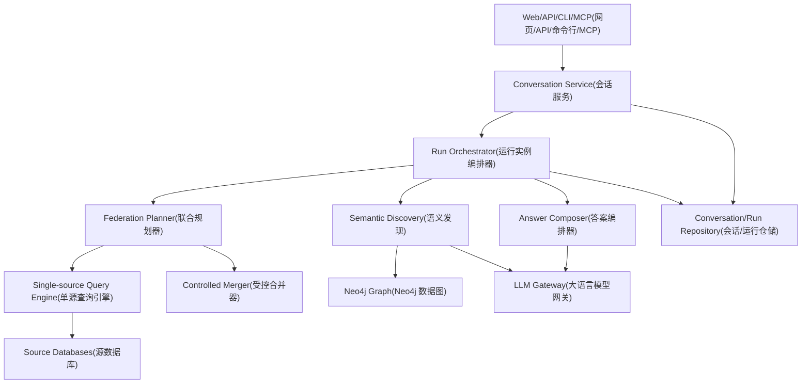
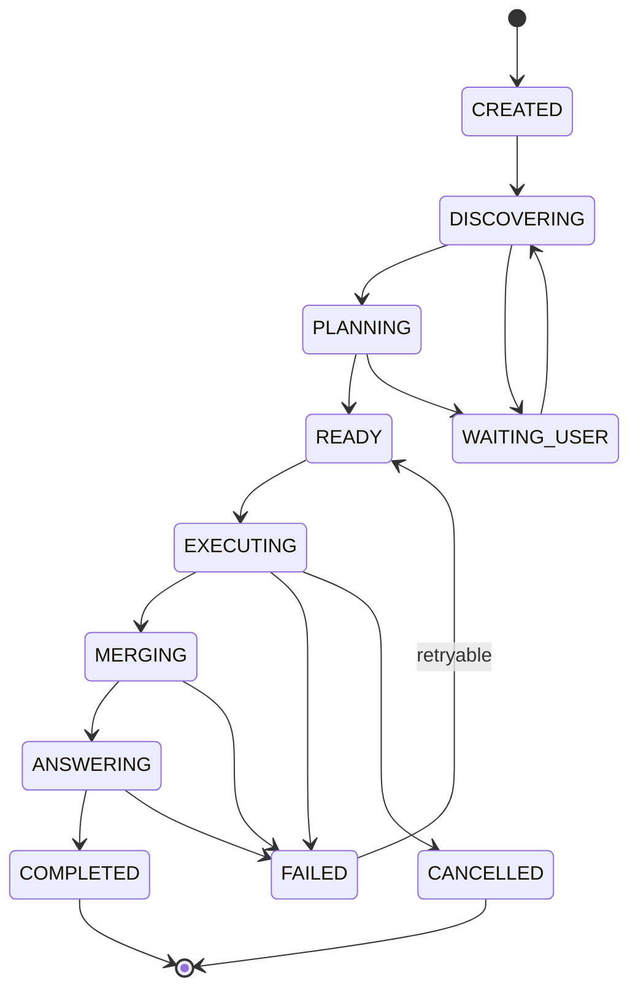
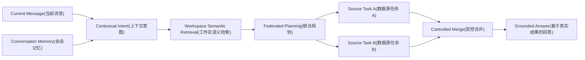
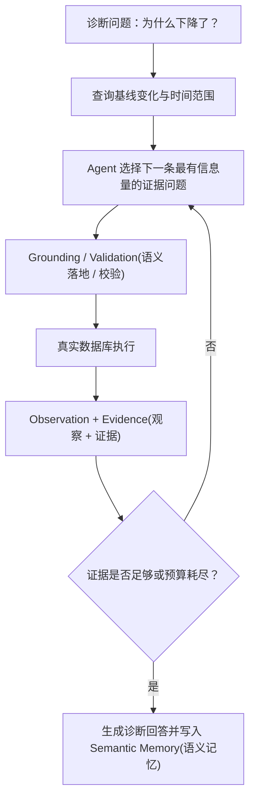
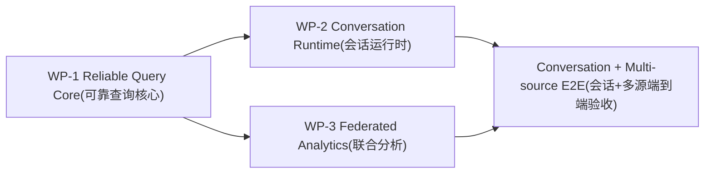

# SmartData Conversational Analytics Runtime & Federated Query Development Plan(对话式分析运行时与联合查询开发计划)

**Version(版本)：1.1**  
**Implementation Baseline(实现代码基线)：`main(主分支)@318f44ee8c3540ed813366c490538b72b960c427`；其后仅增加/修订本开发文档**  
**Scope(范围)：本轮开发设计、开发边界与验收契约；不作为 Roadshow(路演) 既有验收结果的替代**  
**Status(状态)：BOUNDARY FROZEN / READY FOR IMPLEMENTATION(开发边界已冻结 / 可开始实施)**

---

## 0. 文档目的

本轮开发只解决一件产品问题：

> 让 SmartData(智能数据平台) 从“单次、单数据源、容易因意图置信度提前停止的问数页面”，演进为“同一工作区内可持续对话、可记忆、可基于真实数据库结果回答、可按受控方式整合多个数据源”的智能问数工作区。

本轮不是推翻现有 Query Engine(查询引擎)，而是在当前已通过验证的单源安全查询链上增加 Conversation(会话)、Run Runtime(运行实例运行时) 与 Federation(联合查询) 三个上层能力。

必须保持以下既有安全性质：

- Grounding(语义落地) 后才能进入正式查询。
- 单个 `GroundedQueryPlan(落地查询计划)` 只允许一个 `datasource_id(数据源标识)`。
- Plan Validation(计划校验)、Native Validation(原生查询校验)、Revision Fence(扫描版本围栏)、Read-only Execution(只读执行) 不得绕过。
- Neo4j(图数据库) 保存结构、语义和关系证据，不保存并替代源数据库中的完整业务事实。
- 模型不直接拿凭据，不直接执行任意 SQL(结构化查询语言)，不自行确认跨源关系。
- 外部模型、数据库或其他依赖不可用时必须返回明确失败或 BLOCKED(阻塞)，不得生成假答案。

“用户可以提各种各样的问题”的工程定义是：

> 只要问题能够由当前工作区已扫描、当前账号可只读访问的数据支撑，并且查询运算在本轮支持范围内，系统应主动完成语义理解、结构发现、查询、必要的多源整合与答案生成；不能因为模型自报低置信度就先给出泛化澄清。确实缺少数据、关系或能力时，必须说明具体缺什么。

这不是“任何问题都保证有答案”。系统不得用推测补齐数据库中不存在的事实，也不得把相关性描述成因果性。

---

## 1. 当前真实代码状态与问题根因

本文以当前 `main(主分支)` 真实代码为准。

### 1.1 当前正式 Ask(问数) 仍然是一次请求、一次响应

正式入口仍然位于：

- `smartdata/application/service.py -> SmartDataService.ask()`
- `smartdata/application/service.py -> SmartDataService.ask_stream()`
- `smartdata/application/service.py -> _ask_event_records()`

当前请求契约 `AskRequest(问数请求)` 只有：

```text
question
workspace_id
datasource_id
sql
max_rows
```

没有：

```text
conversation_id(会话标识)
run_id(运行标识)
message_id(消息标识)
conversation_context(会话上下文)
resume_token(恢复标识)
```

所以当前 Web(网页端) 上的多次提问本质上是彼此独立的 Ask(问数)，不是可恢复、可继续的会话。

### 1.2 图片中的“低置信度泛化澄清”是现有代码明确产生的

当前：

`smartdata/semantic/clarification.py -> ClarificationBuilder(澄清构造器)`

存在以下逻辑：

```text
if query.confidence < 0.6:
    “当前业务意图置信度较低，请确认指标、维度和时间范围。”
```

这意味着模型只要把 `confidence(置信度)` 报得较低，系统会在 Semantic Retrieval(语义检索) 和 Grounding(语义落地) 前停止。

因此像“汇总发货数据”这类问题，即使已扫描结构中存在发货表、发货时间、数量、金额等真实字段，也可能没有机会进入真实结构发现阶段。

本轮必须修改这个判定原则：

> 模型自报的 `confidence(置信度)` 只能作为观测信息，不能单独成为阻断执行的硬门。

真正需要用户澄清的条件必须来自确定性冲突：

- 用户约束无法可靠解析且继续执行会丢条件；
- 一个业务词绑定到多个不同的真实物理目标；
- 需要的业务字段在真实结构中不存在；
- 存在多个可执行口径且系统不能安全决定；
- 时间表达存在多个真实业务时间轴；
- 查询需要当前不支持的计算或跨源关系。

### 1.3 当前单源安全边界是正确的，不能为了跨源功能拆掉

当前：

- `GroundedQueryContext(落地查询上下文)` 有 `allowed_datasource_ids(允许的数据源)`；
- `GroundedQueryPlan(落地查询计划)` 有唯一 `datasource_id(数据源标识)`；
- Plan(计划) 中的所有 `data_objects(数据对象)` 必须属于同一个数据源；
- `SemanticGrounder(语义落地器)` 当前会把跨源 Binding(绑定) 视为不可执行问题。

这些不是缺陷，而是现有查询内核的重要安全属性。

本轮跨源能力必须建立在它的上层，不能把一个 `GroundedQueryPlan(落地查询计划)` 改成多数据源计划。

### 1.4 当前正式 Grounded SQL(落地 SQL) 执行仍然主要是 SQLite(轻量关系数据库) 能力

当前正式链：

```text
GroundedQueryPlan(落地查询计划)
→ GroundedSQLCompiler(落地 SQL 编译器)
→ NativeQuery(原生查询)
→ GroundedQueryExecutor(落地查询执行器)
→ adapter.execute_bound(适配器参数化执行)
```

但当前 `GroundedSQLCompiler(落地 SQL 编译器)` 明确生成 SQLite(轻量关系数据库) 风格的 `?` 参数占位符；`SQLiteAdapter(SQLite 适配器)` 实现了 `execute_bound(参数化执行)`，而 `SQLAlchemyAdapter(SQLAlchemy 适配器)` 当前没有正式实现该参数化接口。

所以“已注册 PostgreSQL(关系数据库)/MySQL(关系数据库) Adapter(适配器)”不等于“已完成正式 Grounded Query(落地查询) 参数化执行”。

本轮如果要让真实数据库成为日常问数入口，必须先把 SQL Dialect Execution(SQL 方言执行) 补齐。

### 1.5 当前模型只参与意图解析，不参与正式结果答案生成

当前 `AiyallmSchemaModel(模型网关)` 已有：

- `parse_business_query()`
- `answer_question()`

但正式 `SmartDataService.ask()` 主链在执行完成后仍使用内部确定性 `_summarize()`，现有测试也明确要求正式 Phase 1(阶段一) 路径不调用模型的 `answer_question()`。

这保证了旧链稳定，但也限制了以下能力：

- 对复杂结果进行自然语言整合；
- 结合多个数据源结果生成统一说明；
- 理解“那按地区看呢”“只看上个月”“跟刚才相比呢”这类连续问答；
- 基于已经验证的结果生成面向业务用户的完整回答。

本轮需要增加独立 Answer Composer(答案编排器)，但它只能读取已验证 Result(结果)、Evidence(证据) 与受控 Conversation Context(会话上下文)，不能重新决定数据库事实。

### 1.6 当前已有 Agent Contract(智能体契约)，但没有正式 Agent Runtime(智能体运行时)

`smartdata/contracts/agent.py` 已存在：

- `TaskSpec(任务规格)`
- `TaskState(任务状态)`
- `MemoryRecord(记忆记录)`
- `PermissionContext(权限上下文)`
- `BudgetSpec(预算规格)`
- `AgentTraceEvent(智能体轨迹事件)`

但当前正式 Ask(问数) 并没有使用这些契约形成可持久化、可恢复的运行时。

本轮不建设通用 Multi-Agent(多智能体) 或通用 Task DAG(任务有向无环图) 引擎。

保持简单：只建设本产品需要的 `Conversation(会话) -> Run(运行实例) -> SourceTask(数据源任务) -> MergePlan(合并计划)`。

---

## 2. 本轮目标与非目标

### 2.1 必须完成

本轮结束后，产品必须具备：

1. 同一 Conversation(会话) 内连续问答。
2. Conversation(会话) 可关闭页面后重新打开，保留消息与已确认上下文。
3. “那按地区看呢”“只看已发货的”“和上个月比较”这类上下文追问可继续执行。
4. 低模型置信度不再直接触发泛化澄清。
5. 当结构中存在足够事实时，系统主动继续 Retrieval(检索) / Grounding(落地) / Query(查询)。
6. 真正有歧义时给出基于真实结构生成的具体选项。
7. 正式自然语言问数 Release Gate(发布门) 锁定 MongoDB(文档数据库)、Redis(内存键值数据库)、PostgreSQL(关系数据库)、MySQL(关系数据库)、SQLite(轻量关系数据库) 五个数据库；每个数据库按其原生数据模型支持受治理、只读、可验证的查询能力。
8. 同一工作区可由 Runtime(运行时) 自动选择一个或多个相关数据源。
9. 多源独立聚合、比较、组合结果可执行。
10. 已确认跨源 Join Mapping(关联映射) 存在时，可做受控跨源关联。
11. 所有最终业务数字来自真实数据库查询或确定性 Merge(合并) 结果。
12. 模型只对已验证数据做自然语言组织，不得生成数据库中不存在的数字。
13. Run(运行实例) 可取消，可在可恢复失败后继续。
14. 前端显示公开的执行阶段、数据源、SQL(结构化查询语言)/Evidence(证据)、结果和可视化，不显示模型内部推理。
15. 现有 `/api/ask`、`/api/ask/stream`、CLI(命令行界面)、MCP(模型上下文协议)、Skill(技能) 兼容链不被破坏。

### 2.2 本轮不做

本轮不做：

- Login(登录) / JWT(JSON 网络令牌) / OAuth(开放授权) / RBAC(基于角色的访问控制) 产品系统；
- 通用 Multi-Agent(多智能体)；
- 通用 Workflow Engine(工作流引擎)；
- 允许模型执行任意 Python(编程语言) / Shell(命令解释器) / SQL(结构化查询语言)；
- 自动把模型猜测发布成公司级 Metric(指标)；
- 自动把同名字段认定为跨库 Join Key(关联键)；
- 分布式事务或跨数据库一致性快照；
- 将完整业务明细复制到 Neo4j(图数据库)；
- Fake Demo Mode(伪演示模式)；
- 在没有因果证据的情况下把相关性或贡献分析包装成确定因果结论；但“为什么下降了”这类诊断问题属于本轮正式能力，Agent(智能体) 可以基于真实数据库结果自主提出并执行有限数量的关键证据问题。

---

## 3. 目标架构

采用 Modular Monolith(模块化单体)。

不拆微服务。部署仍是一个 SmartData(智能数据平台) 应用；代码内部建立严格依赖边界。



依赖原则：

```text
Conversation(会话)
        ↓
Runtime(运行时)
        ↓
Federation(联合编排)
        ↓
Single-source Query Engine(单源查询引擎)
```

反向依赖禁止：

```text
Query Engine(查询引擎) -> Conversation(会话)         禁止
Query Engine(查询引擎) -> Federation(联合编排)       禁止
Semantic(语义) -> Web(网页端)                        禁止
Federation(联合编排) -> 数据库凭据                    禁止
Runtime(运行时) -> Neo4j Driver(Neo4j 驱动)          禁止
Runtime(运行时) -> SQLAlchemy(SQLAlchemy 库)         禁止
```

上层通过 Capability Port(能力端口) 依赖下层能力，不依赖具体基础设施。

---

## 4. 代码结构

不进行全仓大重构。本轮只新增少量顶层模块，并逐步把新增职责从 `SmartDataService(智能数据服务)` 中隔离出去。

建议结构：

```text
smartdata/
├── conversation/
│   ├── models.py
│   ├── repository.py
│   └── service.py
│
├── runtime/
│   ├── models.py
│   ├── orchestrator.py
│   ├── state_machine.py
│   └── events.py
│
├── federation/
│   ├── models.py
│   ├── planner.py
│   ├── validator.py
│   └── merger.py
│
├── capabilities/
│   └── ports.py
│
├── querying/                  # 保留现有单源查询核心
├── semantic/                  # 扩展语义发现，不承担运行状态
├── adapters/                  # 扩展正式参数化执行
├── llm/                       # 扩展会话意图和答案组织能力
├── interfaces/
└── application/
```

前端建议保持同样的功能边界：

```text
web/frontend/src/
├── conversation/
├── run/
├── ask/
├── visualization/
└── evidence/
```

不把会话、SSE(服务器发送事件)、图表、历史、澄清、结果全部继续堆进一个 `AskPanel(问数面板)`。

---

## 5. 核心领域对象

本轮只引入必要对象，不建立通用 Agent(智能体) 对象体系。

### 5.1 Conversation(会话)

保存“用户持续交流的上下文”。

```text
Conversation
- conversation_id
- workspace_id
- title
- datasource_scope
- created_at
- updated_at
- status
```

Conversation(会话) 不保存执行栈。

### 5.2 Message(消息)

```text
Message
- message_id
- conversation_id
- role
- content
- run_id
- created_at
```

消息是用户可见历史。

### 5.3 ConversationMemory(会话记忆)

本轮按 Codex-style Agent Memory Pattern(类似代码智能体的 Agent 语义记忆模式)实现：**完整历史持久化，但每轮只把当前工作集、结构化语义摘要、Evidence Ref(证据引用) 与恢复检查点按需取回**，而不是把完整聊天记录无限塞给模型。这里采用的是这种 Agent(智能体) 工作模式本身，不依赖任何未公开内部实现假设。

```text
ConversationMemory
- selected_datasource_ids
- confirmed_semantic_choices
- active_metric_context
- active_dimension_context
- active_time_context
- active_filters
- previous_business_query_summary
- last_result_shape
- diagnostic_memory_refs
- evidence_refs
- checkpoint_ref
- updated_at
```

记忆分四层：

1. Message History(消息历史)：完整、可审计的用户/助手消息，只负责历史展示与必要的按需取回。
2. Working Set(当前工作集)：最近若干轮与当前问题直接相关的上下文，保持有界。
3. Semantic Memory(语义记忆)：已经确认的指标口径、维度、时间范围、过滤条件、数据源范围、诊断结论摘要等结构化事实。
4. Checkpoint / Evidence Refs(检查点 / 证据引用)：保存 Run(运行实例) 恢复位置和结果证据引用，不复制大结果进 Prompt(提示词)。

原则：

- “销售额本会话按实付金额”属于 Semantic Memory(语义记忆)；
- “今年”“华东”“按地区”这类上下文可持续继承，直到用户显式修改或新问题语义覆盖；
- “销售额全公司永远按实付金额”不因一次会话自动发布为企业级 Metric(指标)；
- Diagnostic Finding(诊断发现) 只有绑定真实 Evidence(证据) 后才能进入记忆；
- 记忆不是权限，不能扩大数据源、对象、字段或 Join Mapping(关联映射) 的执行范围；
- 不建设跨工作区的个人画像式长期记忆。

### 5.4 Run(运行实例)

一次用户消息产生一个 Run(运行实例)。

```text
Run
- run_id
- conversation_id
- message_id
- workspace_id
- status
- current_stage
- revision
- created_at
- updated_at
- completed_at
- failure_code
```

### 5.5 FederatedPlan(联合计划)

```text
FederatedPlan
- plan_id
- source_tasks[]
- merge_plan
- answer_mode
```

### 5.6 SourceTask(数据源任务)

一个 SourceTask(数据源任务) 永远只访问一个数据源。

```text
SourceTask
- task_id
- datasource_id
- business_subquery
- grounded_context
- grounded_query_plan
- status
- result_ref
- evidence_ref
```

其中 `grounded_query_plan` 继续使用现有 `GroundedQueryPlan(落地查询计划)`。

### 5.7 MergePlan(合并计划)

第一版只允许白名单操作：

```text
compare_scalars(标量比较)
combine_scalars(标量组合)
union_rows(行集合并)
align_time_series(时间序列对齐)
keyed_join(按键关联)
```

禁止：

- 模型提供 Python(编程语言) 代码进行合并；
- 任意表达式执行；
- 未受控的无限中间结果。

---

## 6. Run State Machine(运行实例状态机)



正式状态：

```text
CREATED
DISCOVERING
PLANNING
WAITING_USER
READY
EXECUTING
MERGING
ANSWERING
COMPLETED
FAILED
CANCELLED
BLOCKED
```

禁止使用多个 Boolean(布尔值) 字段组合运行状态。

状态更新使用 `revision(版本)` 做乐观并发控制，避免用户重复提交或网络重连导致同一个 Run(运行实例) 被同时推进两次。

---

## 7. 新的自然语言问数主链

### 7.1 总流程



### 7.2 单源问题

如果语义发现最终只需要一个数据源：

```text
Conversation Context(会话上下文)
→ BusinessQuery(业务查询)
→ Retrieval(检索)
→ Grounding(语义落地)
→ GroundedQueryContext(落地查询上下文)
→ GroundedQueryPlan(落地查询计划)
→ Validation(校验)
→ Native Query(原生查询)
→ Read-only Execution(只读执行)
→ Typed Result(类型化结果)
→ Answer Composer(答案编排器)
```

这里继续使用现有 Query Engine(查询引擎)。

### 7.3 多源问题

如果问题需要多个数据源：

```text
BusinessQuery(业务查询)
        ↓
Workspace Discovery(工作区发现)
        ↓
FederatedPlan(联合计划)
        ↓
┌──────────────┬──────────────┐
│ SourceTask A │ SourceTask B │
└──────┬───────┴──────┬───────┘
       ↓              ↓
单源 Grounding     单源 Grounding
       ↓              ↓
单源 Plan          单源 Plan
       ↓              ↓
真实数据库执行       真实数据库执行
       └──────┬───────┘
              ↓
      Controlled Merge(受控合并)
              ↓
       FederatedEvidence(联合证据)
              ↓
       Answer Composer(答案编排器)
```

关键不变量：

> `FederatedPlan(联合计划)` 可以包含多个 `GroundedQueryPlan(落地查询计划)`；任何一个 `GroundedQueryPlan(落地查询计划)` 本身仍然禁止跨源。

---

## 8. 解决当前“泛化澄清”问题的具体改造

### 8.1 修改 Clarification Policy(澄清策略)

当前必须删除以下产品行为：

> 仅因为模型 `confidence < 0.6` 就要求“确认指标、维度和时间范围”。

改为：

```text
模型 confidence(置信度)
        ↓
只作为 Trace(执行轨迹) / 诊断信息
        ↓
继续 Semantic Retrieval(语义检索)
        ↓
继续 Grounding(语义落地)
        ↓
由真实候选决定是否需要澄清
```

### 8.2 澄清必须具体

错误：

```text
请确认指标、维度和时间范围。
```

正确：

```text
“销售额”在当前数据中存在两个可查询口径：
1. 订单总额：orders.total_amount
2. 实付金额：payments.paid_amount
请选择本次会话使用的口径。
```

或：

```text
当前已扫描数据中没有发现发货日期字段。
已发现：
- orders.created_at：下单时间
- payments.paid_at：支付时间
如果你要按发货时间统计，需要补充包含发货时间的数据源。
```

具体物理字段只在 Evidence(证据) / 高级展开信息中展示；普通用户选项优先使用业务名。

### 8.3 “汇总发货数据”的目标行为

系统应先做结构发现，而不是先追问泛化问题。

若真实结构中能唯一识别发货实体并存在可汇总数值字段，则直接执行。

若存在多个合理口径，则给真实候选：

```text
你希望汇总：
- 发货单数量
- 发货商品数量
- 发货金额
```

若没有发货数据，则说明：

```text
当前工作区没有发现可确认的发货对象或发货时间字段。
```

---

## 9. 连续问答与记忆

### 9.1 上下文输入

新一轮意图理解输入不再只有：

```text
question
rule_facts
```

而是：

```text
current_question
rule_facts
conversation_context
confirmed_semantic_choices
active_datasource_scope
previous_business_query_summary
```

### 9.2 典型连续问答

```text
用户：今年销售额是多少？
系统：查询真实数据库后回答。

用户：那按地区看呢？
系统记住“那”指上一轮的销售额与今年，只新增“地区”维度。

用户：只看华东。
系统保留指标与时间范围，增加地区过滤。

用户：再跟去年比较。
系统保留当前过滤，增加去年对比。
```

每轮仍然重新经过 Grounding(语义落地) 和 Revision Fence(扫描版本围栏)。

记忆不是权限，也不是执行授权。历史会话不能让下一轮绕过当前数据源状态和当前扫描版本。

### 9.3 记忆层级

正式采用以下 Agent Memory(智能体记忆) 层级：

1. Message History(消息历史)：完整持久化，不默认全部进入模型上下文。
2. Working Set(当前工作集)：当前问题需要的最近消息、上一个 BusinessQuery(业务查询)、当前结果摘要。
3. Semantic Memory(语义记忆)：已确认指标、维度、时间、过滤条件、数据源范围和受证据支持的诊断发现。
4. Evidence / Artifact Refs(证据 / 产物引用)：需要时读取真实结果与证据，不把完整中间结果长期复制进记忆。
5. Run Checkpoint(运行检查点)：用于恢复 WAITING_USER(等待用户)、重试和浏览器断线后的原 Run(运行实例)。

不做：

- 自动跨会话永久记住未经发布的指标定义；
- 自动学习用户权限；
- 自动把历史错误结果作为未来事实；
- 把模型私有推理保存成产品记忆。

### 9.4 Diagnostic Agent Loop(诊断智能体循环)

“为什么下降了”“为什么这个月订单少了”“哪些因素最值得关注”属于本轮正式能力。

Run Runtime(运行实例运行时) 允许 Agent(智能体) 在有限预算内，根据上一条真实查询结果提出下一批最关键的 Evidence Question(证据问题)，再通过同一受治理查询链执行。



Agent(智能体) 优先从真实结构中选择最有价值的可查询问题，例如：

- 下降幅度和对比基线是多少；
- 哪些地区、产品、渠道、客户、状态等真实维度贡献最大；
- 如果受治理指标存在可分解定义，变化来自数量、单价、转化率等哪个组成项；
- 是否存在数据覆盖、空值、重复、状态分布或时间窗口异常；
- 对贡献最大的一个或两个分组继续向下钻取一层。

约束：

- 每个 Evidence Question(证据问题) 都必须重新经过 Retrieval(检索)、Grounding(语义落地)、Plan Validation(计划校验) 和只读执行；
- Agent(智能体) 不能自由写 SQL(结构化查询语言) 绕过 Query Engine(查询引擎)；
- 默认最多 5 个诊断子问题、最多 2 轮自适应追加，具体预算由 Run Budget(运行预算) 控制；
- 只有真实 Evidence(证据) 支持的 Observation(观察) 才能进入 Diagnostic Memory(诊断记忆)；
- 用户继续问“那华东为什么降得更多？”时，优先复用已确认的诊断上下文和 Evidence Ref(证据引用)，再执行必要的新查询；
- 没有因果设计时，回答使用“数据显示主要贡献来自……”“与……同时变化”等证据化表达，不声称统计贡献就是确定因果。


---

## 10. Answer Composer(答案编排器)

新增独立 Answer Composer(答案编排器)，放在查询执行之后。

输入只能包含：

```text
current_question
conversation_context
typed_results
merge_result
execution_evidence
source_timestamps
truncation_flags
```

禁止输入：

- 数据库密码、Token(令牌)、证书；
- 未经执行验证的 SQL(结构化查询语言)；
- 模型之前的私有推理；
- 未确认的跨源映射作为事实。

Answer Composer(答案编排器) 的职责：

- 把结果组织成自然语言；
- 回答用户实际问题，而不是只返回“查询完成 N 行”；
- 在多源结果间做文字整合；
- 标明截断、时间差、数据缺失；
- 为前端提供推荐的继续追问。

数字事实来源始终是 Result(结果) / Merge Result(合并结果)，模型不能重新计算并覆盖确定性结果。

模型不可用时：

- 查询与结果仍可完成；
- 使用确定性 Fallback Summary(降级摘要)；
- 状态明确记录 `answer_model_unavailable(答案模型不可用)`；
- 不把模型不可用误报为查询失败。

---

## 11. Five-Database Grounded Execution(五数据库正式落地执行)

本轮正式自然语言问数 Release Gate(发布门) 锁定：

```text
MongoDB(文档数据库)
Redis(内存键值数据库)
PostgreSQL(关系数据库)
MySQL(关系数据库)
SQLite(轻量关系数据库)
```

“锁定”表示这五个数据库都必须完成正式链：

```text
BusinessQuery(业务查询)
→ Retrieval(检索)
→ Grounding(语义落地)
→ GroundedQueryPlan(落地查询计划)
→ Deterministic Native Compiler(确定性原生查询编译器)
→ Native Validation(原生查询校验)
→ Read-only Execution(只读执行)
→ Result + Evidence(结果 + 证据)
```

不能把 Adapter(适配器) 已注册当成正式智能问数已支持。

### 11.1 Relational(关系型)：SQLite / PostgreSQL / MySQL

```text
GroundedQueryPlan(落地查询计划)
        ↓
SQL Dialect Compiler(SQL 方言编译器)
        ↓
Bound Native Query(参数化原生查询)
        ↓
Adapter.execute_bound(适配器参数化执行)
```

不能继续让上游固定输出 SQLite(轻量关系数据库) 的 `?` 占位符，再让下游自行猜测转换。物理对象/字段来自 Allowlist(允许列表)，业务值始终走参数绑定。

### 11.2 MongoDB(文档数据库)

现有 `MongoDBAdapter(MongoDB 适配器)` 已能执行受限 `find(查找)` 和只读 `aggregate(聚合)`，并拒绝 `$out`、`$merge`、`$where`、`$function`、`$accumulator` 等危险阶段。

本轮新增 `GroundedMongoCompiler(落地 MongoDB 编译器)`，从 `GroundedQueryPlan(落地查询计划)` 确定性产生 Typed Mongo Read Spec(类型化 MongoDB 只读规格)，支持：

- collection(集合) 必须来自 Grounding(语义落地)；
- filter(过滤)、projection(投影)、sort(排序)、limit(限制)；
- count(计数)；
- 受控 `$match / $group / $count / $sort / $limit` 聚合。

模型不得直接输出可执行 MongoDB Pipeline(MongoDB 管道)。

### 11.3 Redis(内存键值数据库)

现有 `RedisAdapter(Redis 适配器)` 已有只读命令 Allowlist(允许列表)。

本轮新增 `GroundedRedisCompiler(落地 Redis 编译器)`，正式查询只允许从已扫描 Key Type(键类型) 与 Grounded Intent(落地意图) 生成受控只读规格。第一版支持：

- GET / MGET；
- HGET / HGETALL；
- LRANGE；
- SCAN(有界扫描)；
- EXISTS / TYPE / TTL；
- SCARD / SMEMBERS；
- ZCARD / ZRANGE。

Redis(内存键值数据库) 必须尊重其数据模型。如果当前 Key Layout(键布局) 无法表达关系型 Group By(分组聚合) 或跨 Key Join(跨键关联)，系统要具体报告能力/结构缺口，不能假装 Redis(内存键值数据库) 等价于关系数据库。

### 11.4 五库共同执行不变量

- 单源 `GroundedQueryPlan(落地查询计划)`；
- 物理对象来自 Grounding Allowlist(语义落地允许列表)；
- 只读；
- 有界行数 / Key 数 / 文档数；
- 超时；
- Revision Fence(扫描版本围栏)；
- Native Validation(原生查询校验)；
- Evidence(证据) 不泄露业务参数和凭据。


---

## 12. 跨源 Join(关联) 的治理边界

当前自动生成的 `mapping_candidates(映射候选)` 只因为同名字段等结构信号产生，不能直接用于正式跨源 Join(关联)。

当前 `MappingInfo(映射信息)` 也缺少安全执行 Join(关联) 所需的：

- cardinality(基数)
- grain(粒度)
- key uniqueness(键唯一性)
- null policy(空值策略)
- scan revision binding(扫描版本绑定)

因此真正的跨源明细关联需要新增 `JoinMapping(关联映射)`。

```text
JoinMapping
- mapping_id
- workspace_id

- left_datasource_id
- left_object_id
- left_field_path
- left_scan_version
- left_grain

- right_datasource_id
- right_object_id
- right_field_path
- right_scan_version
- right_grain

- cardinality
- null_policy
- status
- confirmed_by
- confirmed_at
```

状态：

```text
CANDIDATE(候选)
CONFIRMED(已确认)
STALE(已过期)
REJECTED(已拒绝)
```

规则：

1. 同名字段不能自动成为 `CONFIRMED(已确认)`。
2. 模型建议只能成为 `CANDIDATE(候选)`。
3. 扫描版本变化后必须变为 `STALE(已过期)` 或重新校验。
4. `keyed_join(按键关联)` 只接受 `CONFIRMED(已确认)` 且版本匹配的映射。
5. 中间结果必须有 `max_rows(最大行数)`、`max_bytes(最大字节数)` 与 `timeout(超时)`。
6. 合并层没有数据库凭据。

---

## 13. 最小权限

本轮不增加用户认证系统，但每个 Run(运行实例) 仍必须有执行范围。

```text
ExecutionScope(执行范围)
- workspace_id
- allowed_datasource_ids
- allowed_data_object_ids
- max_rows_per_source
- max_total_rows
- max_intermediate_bytes
- deadline
- allow_cross_source_join
```

范围只允许收缩，不允许在运行中扩大。

例如用户选择数据源 A、B 后，Planner(规划器) 不得因为模型建议再访问 C。

数据库连接仍经现有 Connection Provider(连接提供器) 和 Credential Store(凭据存储) 打开。

Federation(联合模块) 与 Answer Composer(答案编排器) 永远不接触原始 Secret(秘密值)。

---

## 14. 持久化与失败恢复

为保持简单，第一版仍使用 SQLite(轻量关系数据库) 技术栈，不新增 Redis(内存数据库)、Kafka(消息平台) 或外部 Workflow Store(工作流存储)。

通过 Repository Port(仓储端口) 隔离存储实现。

第一版可以在当前 Catalog SQLite(目录 SQLite) 中增加独立表：

```text
conversation
conversation_message
conversation_memory
run
run_task
run_event
join_mapping
```

代码只能通过：

```text
ConversationRepository(会话仓储)
RunRepository(运行仓储)
JoinMappingRepository(关联映射仓储)
```

访问这些表。

不得让 Runtime(运行时) 到处直接调用 Catalog(目录) SQL(结构化查询语言)。

### 14.1 恢复粒度

失败恢复以 SourceTask(数据源任务) 为粒度。

错误：

```text
Task A = COMPLETED
Task B = TEMPORARY_FAILURE
```

恢复时：

```text
Task A 不重复查询
只重试 Task B
```

### 14.2 自动重试

只自动重试：

```text
timeout(超时)
temporary_unavailable(临时不可用)
rate_limit(限流)
transient_network_error(瞬时网络错误)
```

不自动重试：

```text
permission_denied(权限拒绝)
invalid_mapping(无效映射)
validation_failed(校验失败)
unsupported_query(不支持查询)
schema_revision_changed(结构版本变化)
```

如果结构版本变化，应重新做 Discovery(发现) / Grounding(落地)，而不是用旧 SQL(结构化查询语言) 继续执行。

---

## 15. 可观测性

新 Runtime(运行时) 使用独立 `RunEvent(运行事件)`，不破坏已有 `AskEvent(问数事件)`。

建议公开事件：

```text
run_started
context_ready
semantic_discovery_started
semantic_discovery_completed
clarification_required
federated_plan_ready
source_task_started
source_task_completed
source_task_failed
merge_started
merge_completed
answer_started
answer_delta
answer_completed
run_completed
run_failed
run_cancelled
```

每个事件至少包含：

```text
run_id
sequence
event_type
occurred_at
public_payload
```

区分：

```text
Log(日志)       = 开发与运维排障
Event(事件)     = 产品过程状态
Evidence(证据) = 最终答案的数据依据
```

前端只展示 Event(事件) 和安全 Evidence(证据)，不展示模型内部思维链。

---

## 16. Federated Evidence(联合证据)

现有单源 `ExecutionEvidence(执行证据)` 保持不变。

新增上层 `FederatedEvidence(联合证据)`：

```text
FederatedEvidence
- source_evidence[]
- merge_operation
- merge_mapping_id
- input_row_counts
- output_row_count
- source_started_at[]
- source_completed_at[]
- truncated
```

由于多个数据库无法保证处于同一个事务快照，最终回答应保留每个源的查询时间。

不能说：

> “这是全局同一时刻的绝对一致数据。”

除非未来真的实现并验证了相应的一致性能力。

---

## 17. API(应用程序接口) 设计

现有兼容接口保留：

```text
POST /api/ask
POST /api/ask/stream
```

新 Web(网页端) 逐步切到 Conversation API(会话接口)。

建议最小接口：

```text
POST   /api/conversations
GET    /api/conversations
GET    /api/conversations/{conversation_id}

POST   /api/conversations/{conversation_id}/runs
GET    /api/runs/{run_id}
GET    /api/runs/{run_id}/stream

POST   /api/runs/{run_id}/clarification
POST   /api/runs/{run_id}/cancel
```

创建 Run(运行实例) 与 SSE(服务器发送事件) 传输分离。

这样浏览器断线后，可以通过：

```text
GET /api/runs/{run_id}
GET /api/runs/{run_id}/stream?after_sequence=N
```

继续观察原 Run(运行实例)，而不是重新执行数据库查询。

---

## 18. Web(网页端) 产品形态

智能问数页调整为真正聊天工作区：

```text
┌───────────────┬─────────────────────────────────────┐
│ Conversation  │ Message History                     │
│ History       │                                     │
│ 会话历史       │ 用户问题                             │
│               │ 执行卡片                             │
│ + 新对话       │ 表格 / 图表 / SQL / Evidence         │
│               │ 助手回答                             │
│               │                                     │
│               │                                     │
│               ├─────────────────────────────────────┤
│               │ 固定输入框 + 数据源范围               │
└───────────────┴─────────────────────────────────────┘
```

每条助手消息内部拥有自己的：

- Run Trace(运行轨迹)
- Result(结果)
- Visualization(可视化)
- SQL(结构化查询语言)
- Evidence(证据)
- Clarification Options(澄清选项)

不再把页面分成“上方问一次、下方全局结果”的一次性表单结构。

---

## 19. 三个开发 Work Package(工作包)

本轮不要拆成大量小卡。正式开发只分三个 Work Package(工作包)。

### WP-1 Reliable Query Core(可靠查询核心)

目标：先让“图片中的问题”在单源场景消失，并让五个锁定数据库都具备正式、受治理的自然语言查询执行链。

实现内容：

- 修改 `ClarificationBuilder(澄清构造器)`：模型低置信度不再单独阻断；
- Semantic Retrieval(语义检索) / Grounding(语义落地) 先于语义歧义最终判定；
- 澄清信息改为真实候选驱动；
- 增加具体 Missing Data(缺失数据) 解释；
- SQLite(轻量关系数据库) / PostgreSQL(关系数据库) / MySQL(关系数据库) 参数化 Grounded SQL(落地 SQL)；
- MongoDB(文档数据库) 确定性 Grounded Find/Aggregation(落地查找/聚合) 编译与只读校验；
- Redis(内存键值数据库) Grounded Read Command(落地只读命令) 编译与命令白名单校验；
- 抽出按数据库能力选择的 Native Compiler Port(原生编译器端口)；
- 增加 Answer Composer(答案编排器)，只消费真实 Result(结果) 与 Evidence(证据)；
- 现有单次 `ask()` 仍可正常工作。

验收必须包含：

```text
“汇总发货数据”
“今年销售额是多少”
“按地区统计销售额”
“最近30天订单趋势”
“销售额前10客户”
“支付成功但未发货的订单”
```

对于每个问题：

- 有真实结构和数据 -> 执行；
- 有多个真实口径 -> 给具体选项；
- 缺字段 -> 说明具体缺什么；
- 不允许出现仅因模型 `confidence(置信度)` 低而泛化追问。


### WP-2 Conversation Runtime(会话运行时)

目标：完成连续问答、有语义记忆、诊断式 Agent(智能体) 多步查询与可恢复运行。

实现内容：

- Conversation(会话)、Message(消息)、Run(运行实例) 持久化；
- Codex-style Agent Semantic Memory(类似代码智能体的智能体语义记忆)：Working Set(当前工作集) + Semantic Summary(语义摘要) + Evidence Ref(证据引用) + Checkpoint(检查点)；
- Diagnostic Agent Loop(诊断智能体循环)，支持“为什么下降了”这类多步证据查询；
- Run State Machine(运行状态机)；
- Run Event(运行事件)；
- 断线重连；
- clarification resume(澄清后继续原运行)；
- cancel(取消)；
- Answer Delta(答案增量)；
- 新 Conversation API(会话接口)；
- Web(网页端) 改为聊天工作区。

验收：

```text
Q1: 今年销售额是多少？
Q2: 那按地区看呢？
Q3: 只看华东。
Q4: 跟去年比呢？
Q5: 为什么华东下降得更多？
```

必须验证 Q2/Q3/Q4 不要求用户重新写完整问题；Q5 触发有限的 Diagnostic Agent Loop(诊断智能体循环)，复用已确认的指标、时间、地区上下文和 Evidence Ref(证据引用)；关闭页面重新打开后仍能继续同一 Conversation(会话)。


### WP-3 Federated Analytics(联合分析)

目标：一个问题可受控访问多个数据源并整合真实结果。

实现内容：

- FederatedPlan(联合计划)；
- SourceTask(数据源任务)；
- Controlled Merger(受控合并器)；
- FederatedEvidence(联合证据)；
- 多源并行或受控顺序执行；
- 子任务级失败恢复；
- JoinMapping(关联映射)；
- 受控 `keyed_join(按键关联)`；
- 多源结果统一答案。

验收分两类：

第一类，不需要 Join(关联)：

```text
“对比今年订单销售额和实际回款金额”
“比较订单系统和支付系统最近30天的金额趋势”
```

第二类，需要确认 Join Mapping(关联映射)：

```text
“按客户汇总订单金额和回款金额”
“找出已付款但未发货的订单”
```

无确认映射时必须停止并说明原因，不能因为字段同名就自动关联。

---

## 20. 开发依赖图



WP-2(会话运行时) 与 WP-3(联合分析) 可以在 WP-1(可靠查询核心) 契约稳定后并行，但最终共同进入同一个 E2E(端到端) 验收。

---

## 21. 失败语义

至少区分：

```text
BusinessFailure(业务失败)
- ambiguity
- missing_data
- unsupported_question

PolicyFailure(策略失败)
- unconfirmed_mapping
- result_limit
- execution_scope

DependencyFailure(依赖失败)
- database_unavailable
- graph_unavailable
- model_unavailable
- rate_limited

TechnicalFailure(技术失败)
- internal_error
```

模型不可用和数据库不可用不能混成同一个“问数失败”。

如果数据库结果已经成功得到，但答案模型不可用：

```text
Run = COMPLETED
answer_mode = deterministic_fallback
```

而不是：

```text
Run = FAILED
```

---

## 22. 测试与验收

### 22.1 单元测试

必须覆盖：

- Clarification Policy(澄清策略)；
- Conversation State(会话状态)；
- Run State Machine(运行状态机)；
- Conversation Memory(会话记忆)；
- Federated Plan Validation(联合计划校验)；
- Merge Limits(合并限制)；
- Join Mapping Revision(关联映射版本)；
- Retry Policy(重试策略)；
- Event Sequence(事件序列)；
- SQL Dialect Compilation(SQL 方言编译)；
- Mongo Grounded Compilation(MongoDB 落地编译)；
- Redis Grounded Read Compilation(Redis 落地只读编译)；
- Diagnostic Loop Budget / Evidence Memory(诊断循环预算 / 证据记忆)。

### 22.2 集成测试

真实链必须覆盖五个锁定数据库：

```text
SQLite + Neo4j
PostgreSQL + Neo4j
MySQL + Neo4j
MongoDB + Neo4j
Redis + Neo4j
```

测试正式 Grounding(语义落地) -> Plan(计划) -> Deterministic Native Compile(确定性原生编译) -> Execute(执行) -> Evidence(证据)。

Redis(内存键值数据库) 按其原生数据模型验收，不用关系型 Group By(分组聚合) 能力强行定义成功标准。MongoDB(文档数据库) 必须覆盖 find(查找) 与安全 aggregate(聚合)。


### 22.3 Conversation E2E(会话端到端)

Chrome(浏览器) 真实路径：

```text
创建会话
→ 第一次提问
→ SSE(服务器发送事件)
→ Result(结果)
→ Follow-up(追问)
→ 复用上下文
→ Clarification(澄清)
→ Resume(恢复)
→ 关闭页面
→ 重新打开
→ 历史和上下文仍存在
```

### 22.4 Federated E2E(联合端到端)

至少两个真实数据库：

```text
Datasource A(数据源 A)
Datasource B(数据源 B)
→ 独立查询
→ Merge(合并)
→ Evidence(证据)
→ Answer(回答)
```

必须单独验证：

- 一个源超时；
- 一个源返回空结果；
- 一个源 Scan Version(扫描版本) 改变；
- 中间结果超限；
- Join Mapping(关联映射) 过期；
- 重复键；
- Null Key(空键)；
- 浏览器中途断线；
- 外部模型 HTTP 429(请求过多)。

---

## 23. 本轮冻结开发边界

以下边界已经确认并冻结。实现和验收以本节为准；后续若扩大范围，应先修改本节，再修改代码。

### B1. 本轮正式执行数据库范围：FROZEN(已冻结)

本轮 Query E2E(查询端到端) Release Gate(发布门) 固定为：

```text
MongoDB
Redis
PostgreSQL
MySQL
SQLite
```

这五个必须走正式 Grounding(语义落地) 和确定性原生查询执行链。其他已注册 Driver(驱动) 继续保留现有 Scan(扫描) / 既有能力，但不属于本轮自然语言问数 Release Gate(发布门)。

### B2. 跨源明细 Join(关联)：FROZEN(已冻结)

纳入本轮，但只支持已确认 `JoinMapping(关联映射)`，且第一版只做等值 Key Join(键关联)。不做任意模糊 Join(关联)、近似字符串 Join(关联) 和模型猜 Join(关联)。

### B3. Conversation Memory(会话记忆)：FROZEN(已冻结)

采用 Codex-style Agent Semantic Memory(类似代码智能体的智能体语义记忆模式)：

- 当前 Conversation(会话) 内持久化；
- 会话重开后仍生效；
- Working Set(当前工作集) + Semantic Memory(语义记忆) + Evidence Ref(证据引用) + Checkpoint(检查点)；
- 不把完整历史每轮全部塞给模型；
- 诊断问题的已验证发现可写入 Diagnostic Memory(诊断记忆)；
- 不自动跨 Conversation(会话) 传播业务口径；
- 正式企业 Metric(指标) 仍需独立治理发布。

### B4. 自动数据源选择：FROZEN(已冻结)

- 默认“工作区自动选择”；
- 用户可手工限制多个数据源；
- Runtime(运行时) 只能从用户允许范围内缩小选择，不能扩大。

### B5. 诊断类“为什么”问题：FROZEN(已冻结)

属于本轮正式 Agent(智能体) 能力。Agent(智能体) 可以根据真实查询结果自主提出少量最关键的 Evidence Question(证据问题)，再走正式 Query Engine(查询引擎) 执行，并把结果和 Evidence Ref(证据引用) 写入 Diagnostic Memory(诊断记忆)。

默认预算：最多 5 个诊断子问题、最多 2 轮自适应追加。

没有因果实验或明确因果数据设计时，不输出“X 导致 Y”的确定因果结论；允许给出有数据库证据支持的贡献分析、异常定位和优先解释。

### B6. Answer Composer(答案编排器) 模型降级：FROZEN(已冻结)

模型不可用时保留查询成功结果，以确定性文本回答，并记录 `answer_model_unavailable(答案模型不可用)` / `fallback(降级)`，不丢失数据库结果。

### B7. 运行状态存储：FROZEN(已冻结)

第一版使用现有 SQLite(轻量关系数据库) 运行存储，通过 Repository Port(仓储端口) 隔离。不新增 Redis(内存数据库)、消息队列或分布式状态服务作为运行状态基础设施。

### B8. 旧 Ask API(问数接口) 生命周期：FROZEN(已冻结)

本轮保留并继续回归。新 Web(网页端) 使用 Conversation API(会话接口)。CLI(命令行界面) / MCP(模型上下文协议) / Skill(技能) 暂不强制迁移到 Conversation(会话)。

### B9. 权限范围：FROZEN(已冻结)

本轮沿用现有数据源/工作区/执行范围安全边界，不新增 Login(登录)、JWT(JSON 网络令牌)、OAuth(开放授权)、字段级或行级 RBAC(基于角色的访问控制)。

因此本轮可以保证只读、凭据隔离、Execution Scope(执行范围) 不扩大，但不能宣称已经具备企业级字段脱敏或行级授权。

### B10. 跨源一致性：FROZEN(已冻结)

本轮不实现跨数据库分布式事务快照。FederatedEvidence(联合证据) 必须保存各数据源独立的取数开始/完成时间；最终回答不能把不同数据库结果表述为天然来自同一事务时点。


---

## 24. Definition of Done(完成定义)

本轮不是以“页面看起来像聊天”作为完成。

必须同时满足：

1. 图片中的低置信度泛化澄清不再由单一模型 `confidence(置信度)` 触发。
2. 可回答的问题必须真实执行数据库，不使用 Fake Result(假结果)。
3. 模型生成回答中的业务数字能够在 Result(结果) / Evidence(证据) 中找到来源。
4. 连续四轮以上上下文追问通过真实 E2E(端到端)。
5. 会话重新打开后继续追问通过，Semantic Memory(语义记忆) 正确恢复。
6. MongoDB(文档数据库)、Redis(内存键值数据库)、PostgreSQL(关系数据库)、MySQL(关系数据库)、SQLite(轻量关系数据库) 五个 Release Gate(发布门) 数据库的正式 Grounded Query(落地查询) E2E(端到端) 全部通过。
7. “为什么下降了”类问题能在预算内自主执行多条受治理证据查询，并把已验证诊断发现写入 Conversation Semantic Memory(会话语义记忆)。
8. 两数据源独立聚合整合通过。
9. 有确认映射的跨源 Key Join(键关联) 通过。
10. 无确认映射时明确拒绝 Join(关联)。
11. 一个子任务失败后可恢复，不重复已成功子任务。
12. SSE(服务器发送事件) 断线后可从事件序号继续观察，不导致查询重新执行。
13. Run Event(运行事件)、SQL(结构化查询语言)/Native Query(原生查询)、Evidence(证据)、Source Timestamp(数据源取数时间) 可观察。
14. 旧 `/api/ask` / CLI(命令行界面) / MCP(模型上下文协议) 回归不破坏。
15. 外部依赖不可用时状态真实，不伪造 PASS(通过)。


---

## 25. 最终开发原则

本轮实现时始终遵循：

> Conversation(会话) 管上下文；Runtime(运行时) 管状态；Federation(联合编排) 管多个单源任务；Query Engine(查询引擎) 管单源可信查询；Merger(合并器) 只做白名单确定性合并；Answer Composer(答案编排器) 只根据已经验证的数据组织回答。

如果某个功能需要破坏这个依赖方向才能实现，应先修改设计，而不是把逻辑继续堆进 `SmartDataService(智能数据服务)`。

这条边界是本轮保持高内聚、低耦合、单一职责、状态可控、失败可恢复、过程可观测、权限最小化和整体简单性的核心。
